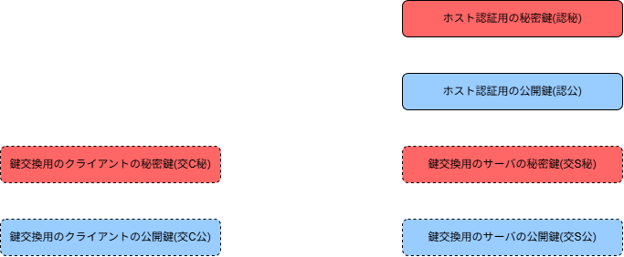
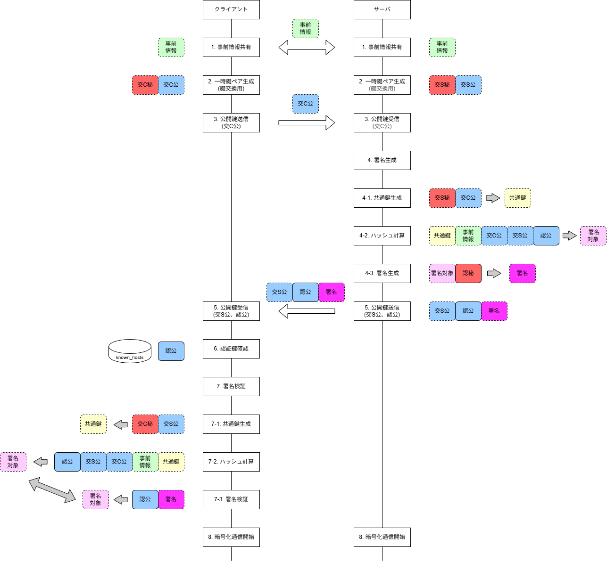

# SSHの公開鍵認証
本資料では、SSHの公開鍵認証について説明する。
具体的には、暗号方式の選択、暗号通信用の鍵生成、サーバ認証までの手順をシーケンス図を用いて説明する。
概念を理解することを目的とし、各アルゴリズムの詳細は省略している。

署名検証や鍵交換アルゴリズムなどについては、補足情報として記載する。

## 用語集
本資料で使用する用語を以下にまとめる。

| 用語 | 目的 | 生成者 |
|------|------|--------|
| 鍵交換用のクライアントの秘密鍵/公開鍵 | クライアントとサーバの安全な通信路を確立 | クライアント |
| 鍵交換用のサーバの秘密鍵/公開鍵 | クライアントとサーバの安全な通信路を確立 | サーバ |
| ホスト認証用の秘密鍵/公開鍵 | サーバ認証用 | サーバ |
| 共通鍵 | 暗号化通信で使用される鍵 | クライアントとサーバ |
| 事前情報 | プロトコルバージョン、暗号方式、鍵交換アルゴリズムなどの情報 | クライアントとサーバ |

シーケンス図では以下のように表記する。

## シーケンス
### 前提条件
* 手順1 ~ 7-3の通信は、共通鍵が確立される前なので、共通鍵による暗号化通信は行われない。(暗号化されていない通信で行われる)
* 手順8以降の通信は、共通鍵を用いて暗号化された通信で行われる。

### シーケンス図

### シーケンス説明
1. クライアント-サーバ間で、暗号方式や鍵交換アルゴリズムなどを決定する。これらの情報をクライアント-サーバ間で交換する。
2. クライアントとサーバは、鍵交換用の秘密鍵と公開鍵を生成する。
これらの鍵は、通信セッションごとに生成される。
3. クライアントは、鍵交換用の公開鍵をサーバに送信する。
4. 署名検証
    4-1. サーバは、クライアントの「鍵交換用の公開鍵」とサーバの「鍵交換用の秘密鍵」を用いて、「共通鍵」を生成する。詳細は、「鍵交換アルゴリズム」を参照。

    4-2. サーバは、以下を用いてハッシュ値(署名対象)を生成する。
    * 4-1で生成した「共通鍵」
    * 1で交換した「事前情報」
    * クライアントの「鍵交換用の公開鍵」
    * サーバの「鍵交換用の公開鍵」
    * サーバの「ホスト認証用の公開鍵」
  
    4-3. 4-2で生成された「署名対象」をサーバの「ホスト認証用の秘密鍵」で署名する。
5. サーバは、クライアントに対して、以下を送信する。
    * サーバの「鍵交換用の公開鍵」
    * サーバの「ホスト認証用の公開鍵」
    * 4-3で生成した「署名」

6. クライアントは、サーバの「ホスト認証用の公開鍵」を確認する。
    6-1. クライアントは、サーバの「ホスト認証用の公開鍵」が、クライアントが保持している「ホスト認証用の公開鍵」と一致するか確認する。
    6-2. 一致しない場合は、ユーザに信頼できるホストか確認する。

7. 署名検証
    7-1. クライアントは、サーバの「鍵交換用の公開鍵」とクライアントの「鍵交換用の秘密鍵」を用いて、「共通鍵」を生成する。詳細は、「鍵交換アルゴリズム」を参照。

    7-2. クライアントは、以下を用いてハッシュ値(署名対象)を生成する。
    * 7-1で生成した「共通鍵」
    * 1で交換した「事前情報」
    * クライアントの「鍵交換用の公開鍵」
    * サーバの「鍵交換用の公開鍵」
    * サーバの「ホスト認証用の公開鍵」

    7-3. クライアントは、サーバの「署名」をサーバの「ホスト認証用の公開鍵」で検証する。7-2で生成された署名対象と一致することを確認する。

8. クライアントとサーバは、4-1と7-1で生成した「共通鍵」を用いて、暗号化された通信を行う。

### シーケンス補足
* 4-1と7-1で生成される「共通鍵」は、クライアントとサーバで同一の値になる。
仮に、1 ~ 7-3までの通信内容を盗聴したとしても、「鍵交換用の秘密鍵」が漏洩しない限り、「共通鍵」を生成することはできない。
* 新しいSSHセッションを開くたび、1 ~ 8の手順が再度行われる。
1回目の接続では、「ホスト認証用公開鍵」がknown_hostsに登録されていないため、クライアントのユーザに警告を出す。この場合、クライアントのユーザは、送られてきた「ホスト認証用公開鍵」が信頼できるか確認する必要がある。
2回目以降の接続では、「ホスト認証用公開鍵」がknown_hostsに登録されているため、クライアントのユーザは確認は不要となる。

### 攻撃例
悪意のある攻撃者が偽のサーバを立てて、クライアントと通信を試みる場合を考える。
(クライアントは、正しいサーバと通信していると思っているが、実際は攻撃者と通信している状態)

#### 前提条件
* クライアントは意図せずに攻撃者のサーバとの通信を試みている
DNSキャッシュポイズニングなどの攻撃により、クライアントが攻撃者のサーバのIPアドレスを正規のサーバのIPアドレスと誤認している状態
* 2回目以降の通信で、悪意のある攻撃者が攻撃を試みている
初回接続時は、手順6でクライアントの認証情報を確認するが、ここでは正規のサーバの「ホスト認証用の公開鍵」を受信している状態

#### 攻撃1: 攻撃者の「ホスト認証用の公開鍵」をクライアントに送信した場合
この場合、手順6で、クライアントは、known_hostsファイルに保存されている「ホスト認証用の公開鍵」と、攻撃者から受け取った「ホスト認証用の公開鍵」を比較するが、一致しないため、クライアントのユーザは攻撃者のサーバと通信を試みていることに気づくことができる。

#### 攻撃2: 攻撃者が正規の「ホスト認証用の公開鍵」と攻撃者の「ホスト認証用秘密鍵」で署名された署名をクライアントに送信した場合
この場合、手順6はパスするが、手順7-3でクライアントは、攻撃者の「ホスト認証用秘密鍵」で署名された「署名」を、正規の「ホスト認証用の公開鍵」で検証し、失敗するため、クライアントのユーザは攻撃者のサーバと通信を試みていることに気づくことができる。

#### 攻撃3: 正規の「ホスト認証用秘密鍵」が漏洩している場合
この場合、攻撃者は、正規の「ホスト認証用秘密鍵」を用いて、正規の「ホスト認証用公開鍵」で検証可能な署名を生成することができるため、手順7-3をパスすることができ、クライアントのユーザは攻撃者のサーバと通信を試みていることに気づくことができない。

# 補足情報
## 署名検証
## 鍵交換アルゴリズム